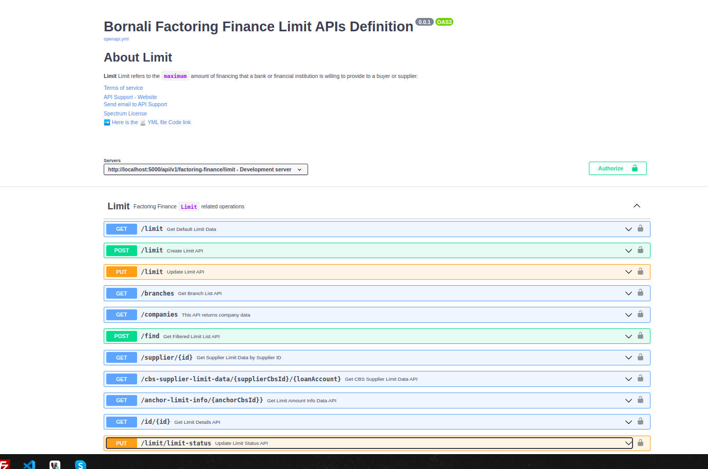

## Implemented in yml code in swagger.

[ Live Bornali API documentation in Swagger UI](https://bappasahabapi.github.io/)

## Covered

- Authentication
    - Basic Authentication
    - Bearer Authentication
    - JWT
- Component Concept
    - Schema
    - Request Code
    - Response Code
    - HTTPS Code
    - Add Security Schema
